# なにこれ？

Beat Saberを遊んでScore Saberに送信したスコアを表示するWindowsアプリです。

柔軟なフィルターとソートによって目的の譜面のスコアを簡単に確認することができます。

未プレイのランク譜面も表示できるのでランク譜面の消化具合を確認することもできます。

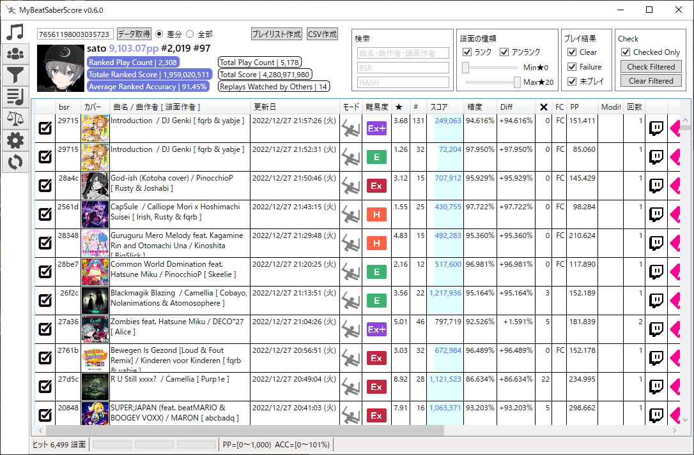

# インストール

[latest](https://github.com/tkns3/MyBeatSaberScore/releases/latest)から`MyBeatSaberScore.exe`をダウンロードします。

任意の場所に`MyBeatSaberScore`フォルダを作成してその中にダウンロードした`MyBeatSaberScore.exe`を配置してください。

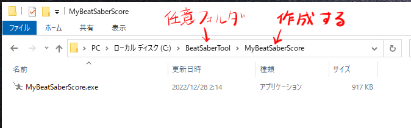

※`MyBeatSaberScore`フォルダのフォルダ名は変更しても問題ありません。

※以降はインストールで作成したフォルダのことをインストールフォルダと記載します。

# アンインストール

インストールフォルダを削除してください。

# アップデート

## v0.6.0以上のバージョンを使用している場合

アプリ内でアップデートボタン（画像内①）をクリックすると最新の実行ファイルをダウウンロードして自動的に再起動します。

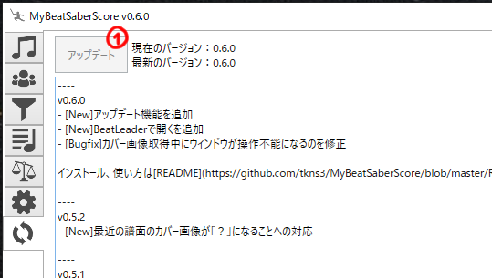

現在のバージョンが最新の場合はアップデートボタンはクリックできません。

## v0.6.0未満のバージョンを使用している場合

インストールフォルダから`data`フォルダ、`log`フォルダ以外を削除します。

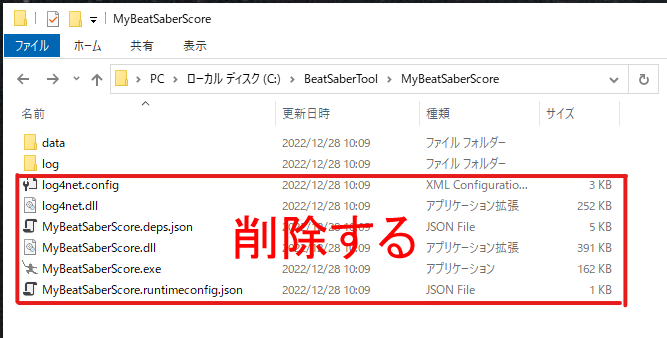

[latest](https://github.com/tkns3/MyBeatSaberScore/releases/latest)から`MyBeatSaberScore.exe`をダウンロードしてインストールフォルダに配置します。

# 使い方

## 起動

`MyBeatSaberScore.exe`を実行してください。

「WindowsによってPCが保護されました」と表示された場合、メッセージ内の「詳細情報」をクリックすると現れる「実行」ボタンをクリックしてください。

英語で「.NETが必要」の旨のメッセージが表示された場合、次の「.NETランタイムのインストール（一度だけ）」を行ってください。

### .NETランタイムのインストール

.NET 6.0のSDKまたはランタイムをインストールしていない場合は[.NET 6.0 ランタイムのダウンロード](https://dotnet.microsoft.com/ja-jp/download/dotnet/6.0/runtime)からお使いのPC環境にあわせたランタイムをダウンロードしてインストールしてください。

例えばお使いのPCがWindows10の64bit版であれば「デスクトップ アプリを実行する」の項にある「X64のダウンロード」を選択します。

間違えてコンソールアプリ用のランタイムをダウンロードしないように気を付けてください。

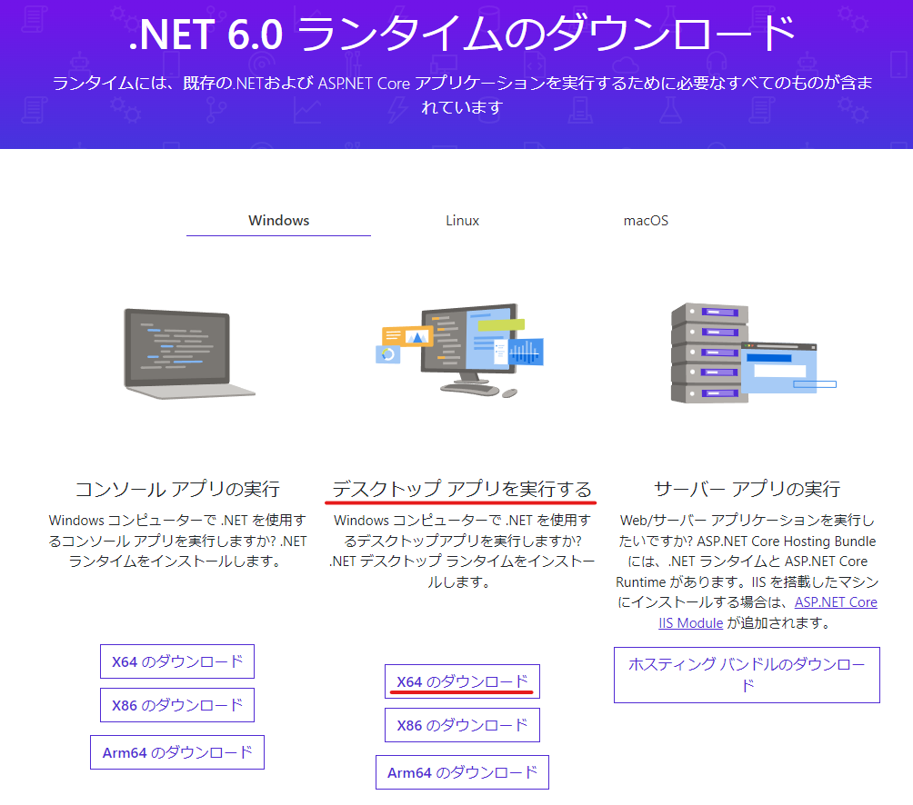

## データ取得

左上のテキストボックス（画像内①）にスコアセイバーのプロファイルIDを入力し「データ取得」（画像内②）ボタンをクリックします。

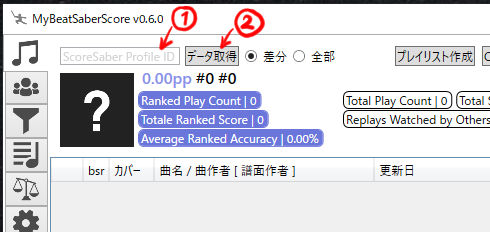

スコアセイバーの個人ページURLが`https://scoresaber.com/u/76561198003035723`であれば`76561198003035723`の部分がプロファイルIDです。

初回は全プレイ履歴やカバー画像を取得するためダウンロードに時間がかかります。気長に待ってください。

取得したデータは`MyBeatSaberScore.exe`と同じ階層の`data`フォルダに保存しています。

「差分」（デフォルト）を指定した場合、取得済みデータより新しいデータのみを取得します。

「全部」を指定した場合、取得済みデータについてもスコアを取得しなおします。

通常は通信量が少ない「差分」がおすすめです。

次のようなケースは「全部」を試してください。

- 譜面ごとの順位の最新情報が欲しい。
- リウェイトや星変化によって譜面のppがScoreSaberと一致しなくなっている。
- アンランク時代にプレイ済みの譜面がランク化されたが、ランク譜面としてプレイ済みになっていない。

## ユーザー切り替え

ユーザーページで「お気に入りユーザーの管理」と「表示ユーザーの切り替え」ができます。

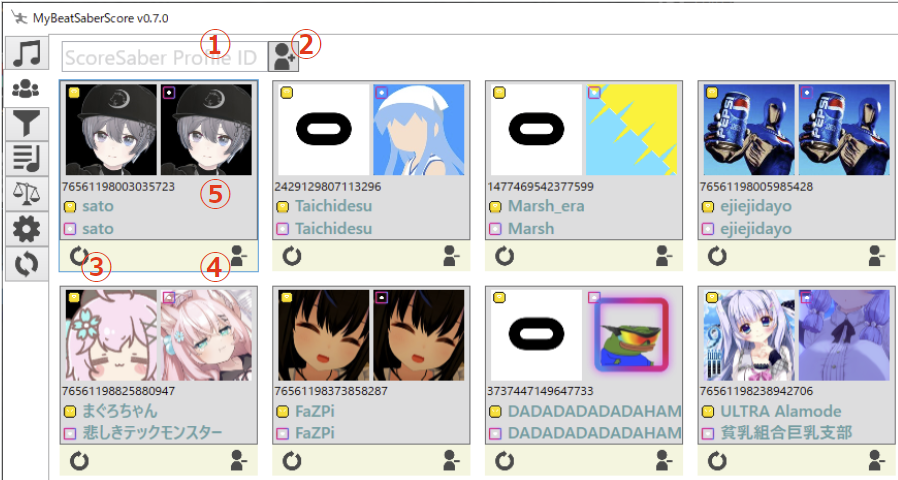

スコアセイバーのプロファイルIDを入力（画像内①）してプラスボタン（画像内②）をクリックするとユーザを追加します。

ユーザごとのマイナスボタン（画像内③）をクリックするとそのユーザを削除します。

ユーザをクリック（画像内④）するとメインページに遷移しそのユーザのスコアを表示します。

この画面からユーザを削除しても取得済みのスコアは削除されません。

## フィルターとソート

メインページの「検索」「譜面の種類」「プレイ結果」で表示対象をフィルターすることができます。

メインページの列ヘッダをクリックするとソート順を変更することができます。

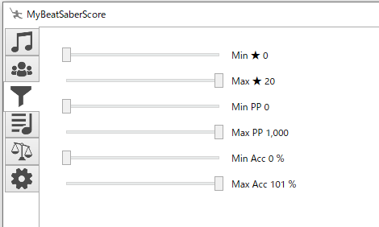

フィルターページでは色々なフィルターを指定することができます。

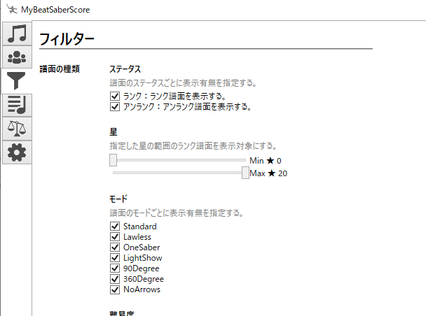

## Copy BSR

Twitchのアイコンをクリックすると「!bsr key」をクリップボードにコピーします。

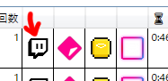

## BeatSaver、ScoreSaber、BeatLeaderをひらく

BeatSaverアイコン（画像内①）、ScoreSaberアイコン（画像内②）、BeatLeadrアイコン（画像内③）をクリックすると譜面のページをブラウザでひらきます。

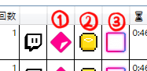

## プレイリスト作成

「プレイリスト作成」ボタンをクリックすると表示している譜面からプレイリストを作成します。

保存ダイアログが表示されるので任意のフォルダに任意の名前で保存してください。

# Ｑ＆Ａ

## 起動しません

.NET 6.0のSDKまたはランタイムがインストールできていない可能性があります。

「使い方」の「.NETランタイムのインストール」を参考に.NET 6.0のランタイムをインストールしてください。

## bsr、精度が表示されない譜面があります

以下のいずれかの条件があてはまる譜面のbsr、精度は表示しません。

- リリースされた直後。
- リパブリッシュされている。
- BeatSaverから削除されている。

リリースされた直後の譜面は数時間たってから「データ取得」を行うと表示されるようになります。
これは「データ取得」で譜面情報を取得しますが取得先のデータがBeatSaverに同期するまで数時間かかります。

リパブリッシュされた譜面のbsr、精度が表示されることはありません。
BeatSaverアイコンをクリックするとブラウザでBeatSaverを開きリパブリッシュ後の譜面情報を確認することができます。

## プレイ結果のFailureの条件は？

Modifiersに「NF」(No Fail)または「SS」(Slow Song)がついている譜面が対象です。

`data/config.json`を直接編集することで条件を変更することが可能です。

例えば「NB」(No Bomb)を条件に追加したい場合は次のように指定します。

    {
      "scoreSaberProfileId": "76561198003035723",
      "failures": [
        "NF",
        "SS",
        "NB"
      ]
    }

## 本ツールとScoreSaberで譜面の順位の値が違う

「差分/全部」のラジオボックスから「全部」を選択して「データ取得」を行うとScoreSaberと同じ順位が表示されるようになります。

「差分」の取得は過去に取得した譜面の順位を取得しなおさないのでScoreSaberとズレが発生します。

## 本ツールとScoreSaberでppの値が違う

「差分/全部」のラジオボックスから「全部」を選択して「データ取得」を行うとScoreSaberと同じppの値が表示されるようになります。

ScoreSaberのpp評価方法は変更されることがあります。

ただし本ツールはその変更を自動的に検知することができないため手動での対応をお願いします。

## 本ツールとScoreSaberで星の値が違う

数時間たってから「データ取得」を行うとScoreSaberと同じ星の値が表示されるようになります。

ScoreSaberの星評価方法は変更されることがあります。

「データ取得」で譜面情報を取得しますが取得先のデータがScoreSaberに同期するまで数時間かかります。

