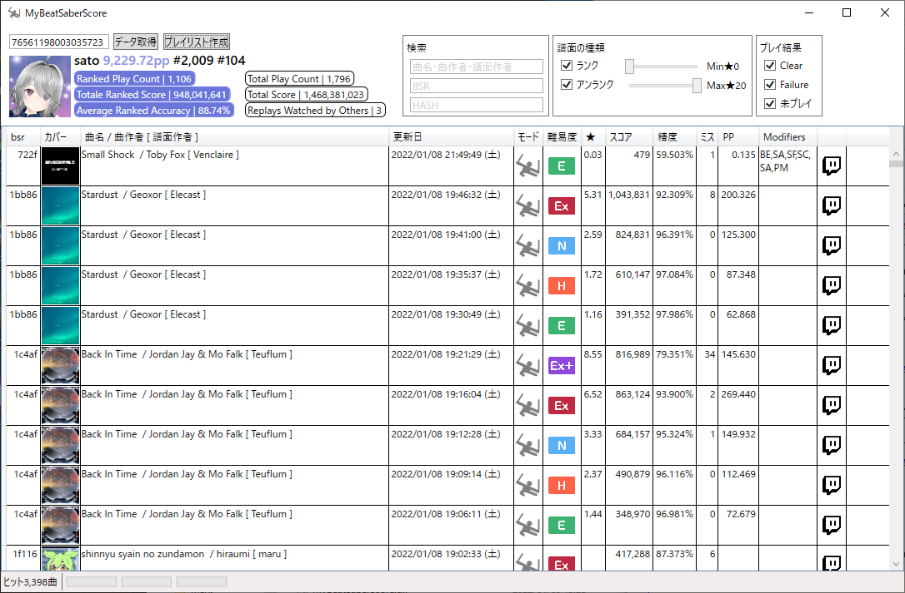

# なにこれ？

Beat Saberを遊んでScore Saberに送信したスコアを表示するWindowsアプリです。

柔軟なフィルターとソートによって目的の譜面のスコアを簡単に確認することができます。

未プレイのランク譜面も表示できるのでランク譜面の消化具合を確認することもできます。

# インストール

[latest](https://github.com/tkns3/MyBeatSaberScore/releases/latest)から`MyBeatSaberScore-vX.X.X.zip`をダウンロードして任意のフォルダに展開してください。

# アンインストール

インストールしたフォルダを丸ごと削除してください。

# アップデート

[latest](https://github.com/tkns3/MyBeatSaberScore/releases/latest)から`MyBeatSaberScore-vX.X.X.zip`をダウンロードして展開したフォルダに含まれている全ファイルをインストールフォルダに上書きしてください。

# 使い方

## .Netランタイムのインストール（一度だけ）

.NET 6.0のSDKまたはランタイムをインストールしていない場合は[.NET 6.0 ランタイムのダウンロード](https://dotnet.microsoft.com/ja-jp/download/dotnet/6.0/runtime)からお使いのPC環境にあわせたランタイムをダウンロードしてインストールしてください。

例えばお使いのPCがWindows10の64bit版であれば「デスクトップ アプリを実行する」の項にある「X64のダウンロード」を選択します。

## 起動

`MyBeatSaberScore.exe`を実行してください。

## データ取得

起動したら左上のテキストボックスにスコアセイバーのプロファイルIDを入力し「データ取得」ボタンをクリックします。
スコアセイバーの個人ページURLが`https://scoresaber.com/u/76561198003035723`であれば`76561198003035723`の部分がプロファイルIDです。

初回は全プレイ履歴やカバー画像を取得するためダウンロードに時間がかかります。気長に待ってください。

次回以降は差分データのみを取得するため比較的短い時間で終わります。

取得したデータは`MyBeatSaberScore.exe`と同じ階層の`data`フォルダに保存しています。

## フィルターとソート

「検索」「譜面の種類」「プレイ結果」で表示対象をフィルターすることができます。

列ヘッダをクリックするとソート順を変更することができます。

## Copy BSR

Twitchのアイコンをクリックすると「!bsr key」をクリップボードにコピーします。

## プレイリスト作成

「プレイリスト作成」ボタンをクリックすると表示している譜面からプレイリストを作成します。

保存ダイアログが表示されるので任意のフォルダに任意の名前で保存してください。

# Ｑ＆Ａ

## 起動しません

.NET 6.0のSDKまたはランタイムがインストールできていない可能性があります。

「使い方」の「.Netランタイムのインストール（一度だけ）」を参考に.NET 6.0のランタイムをインストールしてください。

## アップデートしたら起動しなくなりました

アップデートして起動しなくなったときに.NET6.0のランタイムをインストールすると起動するようになったという例があります。

## アップデートしたら未プレイのランク譜面が表示されなくなった

「最新データを取得」を行うと表示されます。

## bsrが表示されない譜面があるんだけど

BeatSaverから削除された譜面のbsrは表示しません。

リパブリッシュされた譜面のbsrは表示しません。

## プレイ結果のFailureの条件は？

Modifiersに「NF」(No Fail)または「SS」(Slow Song)がついている譜面が対象です。

`data/config.json`を直接編集することで条件を変更することが可能です。

例えば「NB」(No Bomb)を条件に追加したい場合は次のように指定します。

    {
      "scoreSaberProfileId": "76561198003035723",
      "failures": [
        "NF",
        "SS",
        "NB"
      ]
    }

